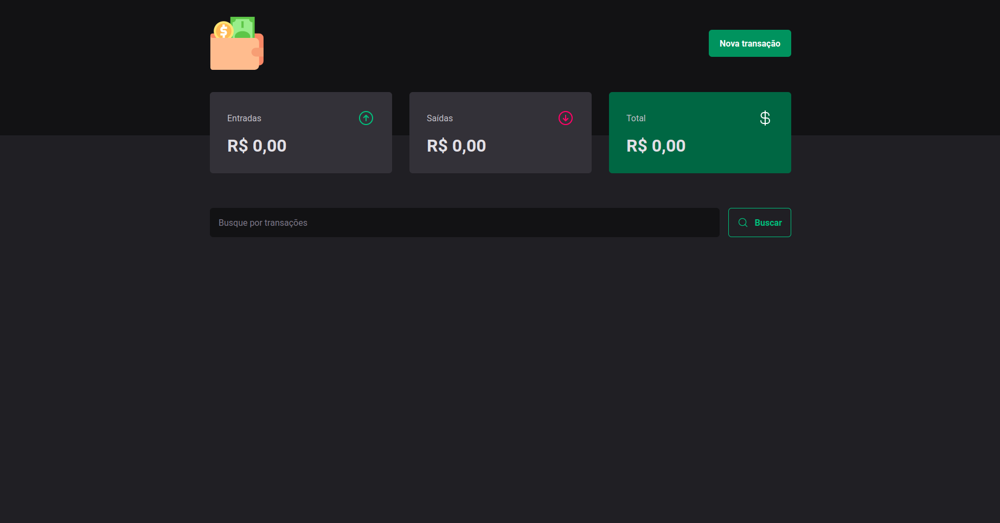
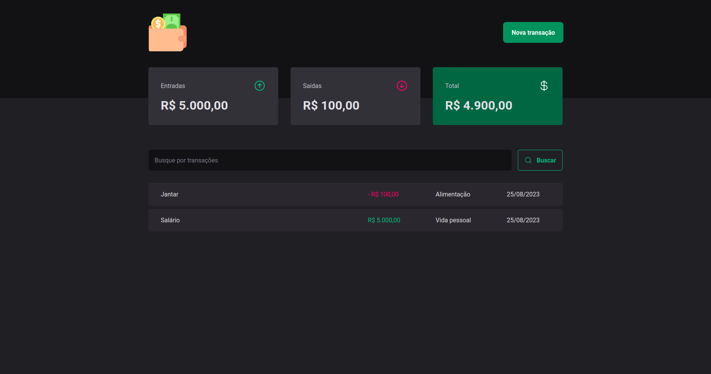
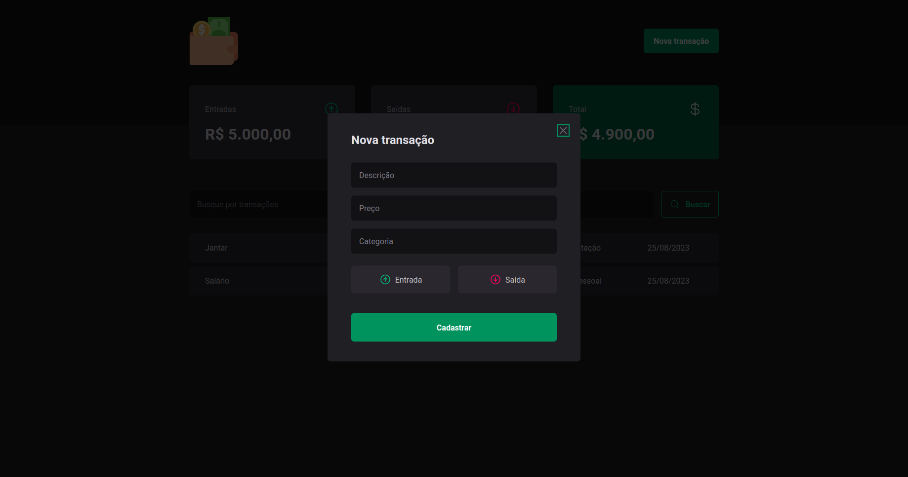

# FINANCE APP

## Descrição
<strong>Finance App</strong> é um website desenvolvido com a finalidade de organizar de maneira inteligente suas entradas e despesas, obtendo automaticamente o saldo dessas transações.

## Tecnologias utilizadas

<ul>
  <li>React</li>
  <li>Typescript</li>
  <li>Styled Components</li>
  <li>Axios</li>
  <li>Json Server</li>
  <li>entre outras...</li>
</ul>

<br>

## Pré-requisitos

Antes de executar a aplicação (caso queira criar sua própria versão), atente-se aos requisitos:
* Ter instalada a versão mais recente do `<Node.js e Yarn>`

<br>

## Executando o Projeto

Caso queira personalizar e criar sua própria versão, siga estas etapas:

1. Instale os pacotes<br>
```
>> yarn install
```
2. Agora, é só executar os comandos:<br>

Para rodar a aplicação:
```
>> yarn dev
```

Para rodar o servidor (json-server):
```
>> yarn dev:server
```

Pronto!

## PREVIEW


<br /><br />


<br /><br />


<br />
